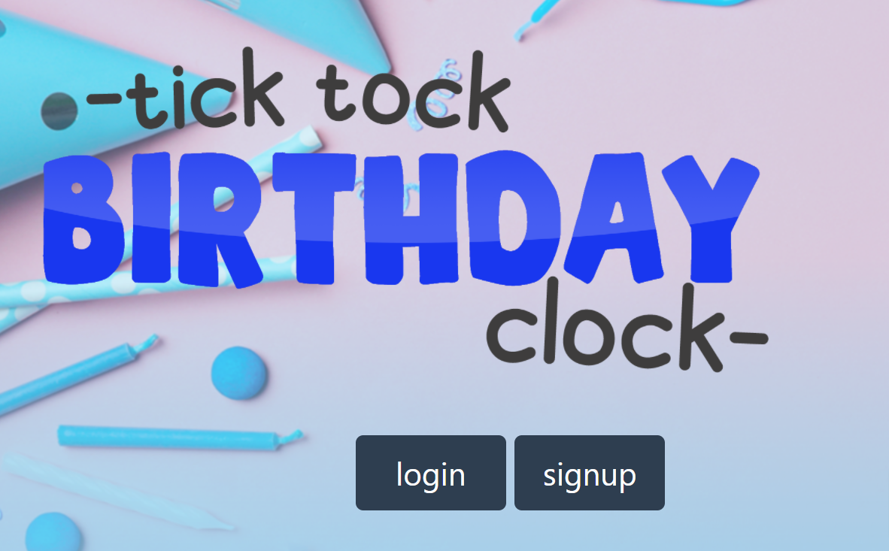

  # 

  # Tick-Tock-Birthday-Clock

  ## Contents:
  #### [Description](#description:)
  #### [Questions](#questions:)
  #### [License](#license:)
  &nbsp;
  
  ## Description: 

  #### This application allows the user to get a countdown clock to their birthday, create and manage a birthday wishlist and search for friends wishlist.
  &nbsp;

     

  
  [Go Tick-Tock-Birthday-Clock on Heroku](https://tick-tock-birthday-clock.herokuapp.com/dashboard)  
  
  [See Tick-Tock-Birthday-Clock Main Project Repo on GitHub](https://github.com/Xr7TSi/Tick-Tock-Birthday-Clock) 

  [See my Birthday-Clock-Project Repo on GitHub](https://github.com/arcangyl1963/birthday-clock-project)
  
  ## Questions?

  #### Github: https://github.com/Xr7TSi
  #### Email us: arcangyl@gmail.com, jrein1296@gmail.com, kimsabraham@gmail.com, printicelaw10@gmail.com
  &nbsp;

  License:
  #### Mozilla
  #### https://opensource.org/licenses/MPL-2.0